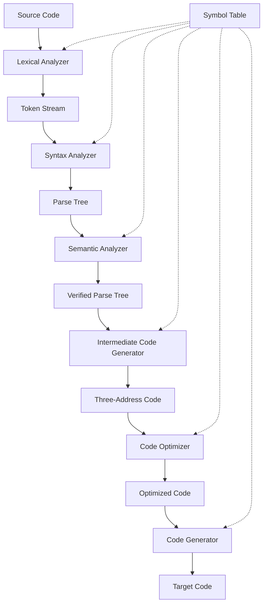

# Compiler Design - Complete Guide

## 🔧 Language Processing System (Cousins of Compiler)

```
Editor
  ↓
PreProcessor
  ↓
Compiler
  ↓
Assembler
  ↓
Linker
  ↓
Loader
```

### Components Overview:

- **Editor**: Creates and modifies source code
- **PreProcessor**: Handles directives like `#include`, `#define`
- **Compiler**: Translates high-level language to assembly/machine code
- **Assembler**: Converts assembly code to object code
- **Linker**: Combines object files and resolves external references
- **Loader**: Loads executable program into memory for execution

---

## 🏗️ Compiler - Six Phases Architecture

```
Source Code
     ↓
Lexical Analysis
     ↓
Syntax Analysis
     ↓
Semantic Analysis
     ↓
Intermediate Code Generator
     ↓
Code Optimization
     ↓
Target Code Generation
```

### Phase Classification:

#### 📋 Analysis Phase (Platform Independent)

- **Lexical Analysis**: Converts source code into stream of tokens
- **Syntax Analysis**: Generates parse tree from tokens
- **Semantic Analysis**: Verifies parse tree semantically
- **Intermediate Code Generator**: Produces three-address code

#### ⚙️ Synthesis Phase (Platform Dependent)

- **Code Optimization**: Improves code efficiency
- **Target Code Generator**: Produces final machine code

---

## 🔍 Phase 1: Lexical Analysis

### Overview

- **First phase** of the compiler
- **Only phase** where we directly interact with source code
- Also known as **Scanner** or **Tokenizer**

### Primary Functions

1. **Tokenization**: Converts source code into stream of tokens
2. **Scanning**: Processes program from left to right, top to bottom
3. **Cleanup**: Removes whitespaces, tabs, and comments
4. **Token Generation**: Produces list of tokens for given lexemes

### Input Buffering Strategy

Uses buffer memory with two key pointers:

| Pointer                  | Function                                       |
| ------------------------ | ---------------------------------------------- |
| **Lexeme Begin Pointer** | Points to starting character of current lexeme |
| **Forward Pointer**      | Traverses through the lexeme characters        |

### Token Classification

| Token Type          | Description        | Examples                         |
| ------------------- | ------------------ | -------------------------------- |
| **Identifiers**     | User-defined names | `variable_name`, `functionName`  |
| **Keywords**        | Reserved words     | `if`, `while`, `class`, `return` |
| **String Literals** | Text constants     | `"Hello World"`, `'A'`           |
| **Operators**       | Operation symbols  | `+`, `-`, `*`, `/`, `==`, `!=`   |
| **Constants**       | Numeric values     | `42`, `3.14`, `true`             |
| **Separators**      | Delimiters         | `{`, `}`, `(`, `)`, `;`, `,`     |

---

## 🌳 Phase 2: Syntax Analysis

### Overview

- **Second phase** of compiler
- Also known as **Parser**
- Tool: **YACC** (Yet Another Compiler Compiler)

### Primary Function

Transforms stream of tokens into **parse trees** using grammatical rules.

### Grammar Definition

Grammar is defined by **four-tuple (P, T, V, S)**:

| Component | Description             | Notation                               |
| --------- | ----------------------- | -------------------------------------- |
| **P**     | Set of production rules | Combination of variables and terminals |
| **T**     | Set of terminals        | Lowercase symbols (actual tokens)      |
| **V**     | Variables/Non-terminals | Uppercase symbols                      |
| **S**     | Start symbol            | Root of grammar                        |

### Example Grammar Rules

```
E → E + E
E → E * E
E → (E)
E → id
```

---

## ✅ Phase 3: Semantic Analysis

### Overview

- **Type Checker** of the compiler
- Verifies parse tree correctness and meaning

### Primary Functions

1. **Parse Tree Verification**: Ensures syntactic correctness translates to semantic meaning
2. **Type Checking**: Validates data type compatibility
3. **Semantic Error Detection**: Identifies logical inconsistencies
4. **Syntax Directed Translation (SDT)**: Method for semantic processing

### Common Semantic Checks

- Variable declaration before use
- Type compatibility in assignments
- Function parameter matching
- Scope resolution
- Array bounds validation

---

## 🔄 Phase 4: Intermediate Code Generator

### Overview

Produces code that is:

- **Not pure high-level** (like source code)
- **Not pure machine-level** (like assembly)
- **Platform independent**

### Three-Address Code

Most popular intermediate representation where every instruction uses **maximum three addresses**.

### Structure

```
result = operand1 operator operand2
```

### Examples

```
t1 = a + b
t2 = c * d
t3 = t1 - t2
```

---

## ⚡ Phase 5: Code Optimization

### Overview

- **Optional but crucial** phase
- Improves code efficiency without changing program behavior

### Optimization Goals

1. **Reduce execution time**
2. **Minimize memory usage**
3. **Decrease code size**
4. **Improve resource utilization**

### Types of Optimization

- **Constant folding**: `3 + 4` → `7`
- **Dead code elimination**: Remove unreachable code
- **Loop optimization**: Reduce loop overhead
- **Register allocation**: Efficient use of CPU registers

---

## 🎯 Phase 6: Target Code Generation

### Overview

- **Final phase** of compiler
- Also known as **Code Generator**

### Output Types

- Assembly code
- Machine code
- Binary code
- Object code

### Primary Functions

1. **Instruction selection**: Choose appropriate machine instructions
2. **Register allocation**: Assign variables to processor registers
3. **Instruction scheduling**: Optimize instruction execution order

---

## 📊 Symbol Table Manager

### Overview

**Critical data structure** created and maintained throughout compilation process.

### Purpose

Stores information about various program entities:

| Entity Type    | Information Stored               |
| -------------- | -------------------------------- |
| **Variables**  | Type, scope, memory location     |
| **Functions**  | Return type, parameters, address |
| **Arrays**     | Element type, dimensions, size   |
| **Objects**    | Class type, methods, attributes  |
| **Interfaces** | Method signatures, inheritance   |

### Operations

- **Insert**: Add new symbols during declaration
- **Lookup**: Search for symbol information
- **Update**: Modify symbol attributes
- **Delete**: Remove symbols when out of scope

### Example Symbol Table Entry

```
Symbol: "count"
Type: integer
Scope: local
Address: 1000
Line: 15
```

---

## 🔄 Compiler Phases Interaction Flow



---

## 🎯 Key Takeaways

1. **Compiler design** is a systematic process with well-defined phases
2. **Each phase** has specific responsibilities and outputs
3. **Symbol table** is shared across all phases
4. **Analysis phases** are platform-independent
5. **Synthesis phases** are platform-dependent
6. **Optimization** is optional but improves performance
7. **Error handling** occurs throughout all phases

---

_This guide provides a comprehensive overview of compiler design principles and phase-wise implementation details._
